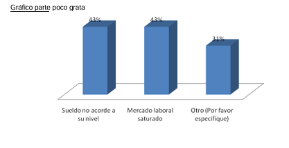

COURSE PROJECT

    <strong>Universidad Peruana de Ciencias Aplicadas</strong> 
    </img> 
    <strong>Ingeniería de Software</strong> 
    <strong>Fundamentos de Arquitectura de Software - NRC6331</strong> 
    <strong>Profesor: Jorge Luis Delgado Vite</strong> 
     Final Project Report

### Startup: **SuitsUPC**

#### Product: **LawConnect**

#### 
Team Members:

| Member                           | Code       |
| -------------------------------- | ---------- |
| Huarcaya Quispe Niurka Lucero    | U20221b226 |
| Pereira Vasquez Nelson Fabrizzio | U202417468 |
| Pumahualcca Garcia Diego Rodrigo | U202219266 |
| Quiñones Tintaya Johan Jorge     | U202218183 |
| Valdivia Quispe Stephano Renan   | U202311294 |

  Julio 2025

## Registro de Versiones del Informe

| Version | Fecha      | Autor                            | Descripción de Modificación            |
| ------- | ---------- | -------------------------------- | -------------------------------------- |
| 1.0.0   | 07/09/2025 | Johan Jorge Quiñones Tintaya     | Desarrollo parcial del **Capítulo I**  |
| 1.1.1   | 07/09/2025 | Nelson Fabrizzio Pereira Vasquez | Desarrollo parcial del **Capítulo II** |

## Project Report Collaboration Insights

**TB1:**  
En esta entrega el equipo definió las bases del tema que se trabajará en el ciclo, sus segmentos objetivo, Lean UX, requisitos y bounded contexts.

**_Figura 4._** Commits del reporte TB1, mostrando la colaboración del equipo en el desarrollo inicial del proyecto.

## Contenido

[Registro de Versiones del Informe](#registro-de-versiones-del-informe)  
[Project Report Collaboration Insights](#project-report-collaboration-insights)  
[Student Outcome](#student-outcome)

## Contenido

[Registro de Versiones del Informe](#registro-de-versiones-del-informe)  
[Student Outcome](#student-outcome)

[Capítulo I: Introducción](#capítulo-i-introducción)  
[1.1. Startup Profile](#11-startup-profile)  
[1.1.1. Descripción de la Startup](#111-descripción-de-la-startup)  
[1.1.2. Perfiles de integrantes del equipo](#112-perfiles-de-integrantes-del-equipo)

[1.2. Solution Profile](#12-solution-profile)  
[1.2.1. Nombre del producto](#121-nombre-del-producto)  
[1.2.2. Antecedentes y problemática](#122-antecedentes-y-problemática)  
[1.2.3. Lean UX Process](#123-lean-ux-process)  
[1.2.3.1. Lean UX Problem Statement](#1231-lean-ux-problem-statement)  
[1.2.3.2. Lean UX Assumptions](#1232-lean-ux-assumptions)  
[1.2.3.3. Lean UX Hypothesis](#1233-lean-ux-hypothesis)  
[1.2.3.4. Lean UX Canvas](#1234-lean-ux-canvas)

[1.3. Segmentos objetivo](#13-segmentos-objetivo)

[Capítulo II: Requirements & Analysis](#capítulo-ii-requirements--analysis)

[2.1. Competidores](#21-competidores)  
[2.1.1. Análisis competitivo](#211-análisis-competitivo)  
[2.1.2. Estrategias y tácticas frente a competidores](#212-estrategias-y-tácticas-frente-a-competidores)

[2.2. Entrevistas](#22-entrevistas)  
[2.2.1. Diseño de entrevistas](#221-diseño-de-entrevistas)  
[2.2.2. Registro de entrevistas](#222-registro-de-entrevistas)  
[2.2.3. Análisis de entrevistas](#223-análisis-de-entrevistas)

[2.3. Needfinding](#23-needfinding)  
[2.3.1. User Personas](#231-user-personas)  
[2.3.2. User Task Matrix](#232-user-task-matrix)  
[2.3.3. Empathy Maps](#233-empathy-maps)  
[2.3.4. As-is Scenario Mapping](#234-as-is-scenario-mapping)

[Capítulo III: Requirements Specification](#capítulo-iii-requirements-specification)

[3.1. To-Be Scenario Mapping](#31-to-be-scenario-mapping)  
[3.2. User Stories](#32-user-stories)  
[3.3. Impact Map](#33-impact-map)  
[3.4. Product Backlog](#34-product-backlog)

[Capítulo IV: Product Architecture Design](#capítulo-iv-product-architecture-design)  
[4.1. Design Concepts, ViewPoints & ER Diagrams](#41-design-concepts-viewpoints--er-diagrams)  
[4.1.1. Principles Statements](#411-principles-statements)  
[4.1.2. Approaches Statements, Architectural Styles & Patterns](#412-approaches-statements-architectural-styles--patterns)  
[4.1.3. Context Diagram](#413-context-diagram)  
[4.1.4. Approach driven ViewPoints Diagrams](#414-approach-driven-viewpoints-diagrams)  
[4.1.5. Relational/Non Relational Database Diagram](#415-relationalnon-relational-database-diagram)  
[4.1.6. Design Patterns](#416-design-patterns)  
[4.1.7. Tactics](#417-tactics)

[4.2. Architectural Drivers](#42-architectural-drivers)  
[4.2.1. Design Purpose](#421-design-purpose)  
[4.2.2. Primary Functionality (Primary User Stories)](#422-primary-functionality-primary-user-stories)  
[4.2.3. Quality Attribute Scenarios](#423-quality-attribute-scenarios)  
[4.2.4. Constraints](#424-constraints)  
[4.2.5. Architectural Concerns](#425-architectural-concerns)

[4.3. ADD Iterations](#415-add-iterations)  
[4.3.X. Iteration N: &lt;Iteration Name&gt;](#43x-iteration-n-iteration-name)  
[4.3.X.1 Architectural Design Backlog N](#43x1-architectural-design-backlog-n)  
[4.3.X.2 Establish Iteration Goal by Selecting Drivers](#43x2-establish-iteration-goal-by-selecting-drivers)  
[4.3.X.3 Choose One or More Elements of the System to Refine](#43x3-choose-one-or-more-elements-of-the-system-to-refine)  
[4.3.X.4 Choose One or More Design Concepts That Satisfy the Selected Drivers](#43x4-choose-one-or-more-design-concepts-that-satisfy-the-selected-drivers)  
[4.3.X.5 Instantiate Architectural Elements, Allocate Responsibilities, and Define Interfaces](#43x5-instantiate-architectural-elements-allocate-responsibilities-and-define-interfaces)  
[4.3.X.6 Sketch Views (C4 & UML) and Record Design Decisions](#43x6-sketch-views-c4-uml-and-record-design-decisions)  
[4.3.X.7 Analysis of Current Design and Review Iteration Goal (Kanban Board)](#43x7-analysis-of-current-design-and-review-iteration-goal-kanban-board)

[Capítulo V: Product Implementation, Validation & Deployment](#capítulo-v-product-implementation-validation--deployment)  
[5.1. Testing Suites & General Patterns](#51-testing-suites--general-patterns)  
[5.1.1. Backend Application Core Testing Suite](#511-backend-application-core-testing-suite)  
[5.1.2. Pattern Based Backend Applications](#512-pattern-based-backend-applications)  
[5.1.3. Pattern Based Custom Software Library](#513-pattern-based-custom-software-library)  
[5.1.4. Framework Pattern Driven Refactoring Report](#514-framework-pattern-driven-refactoring-report)

[5.2. Software Configuration Management](#52-software-configuration-management)  
[5.2.1. Software Development Environment Configuration](#521-software-development-environment-configuration)  
[5.2.2. Source Code Management](#522-source-code-management)  
[5.2.3. Source Code Style Guide & Conventions](#523-source-code-style-guide--conventions)  
[5.2.4. Software Deployment Configuration](#524-software-deployment-configuration)

[5.3.1 Sprint 1](#531-sprint-1)  
[5.3.1.1 Sprint Backlog 1](#5311-sprint-backlog-1)  
[5.3.1.2 Development Evidence for Sprint Review](#5312-development-evidence-for-sprint-review)  
[5.3.1.3 Testing Suite Evidence for Sprint Review](#5313-testing-suite-evidence-for-sprint-review)  
[5.3.1.4 Execution Evidence for Sprint Review](#5314-execution-evidence-for-sprint-review)  
[5.3.1.5 Microservices Documentation Evidence for Sprint Review](#5315-microservices-documentation-evidence-for-sprint-review)  
[5.3.1.6 Software Deployment Evidence for Sprint Review](#5316-software-deployment-evidence-for-sprint-review)  
[5.3.1.7 Team Collaboration Insights during Sprint](#5317-team-collaboration-insights-during-sprint)  
[5.3.1.8 Kanban Board](#5318-kanban-board)

[5.3.2 Sprint 2](#532-sprint-2)  
[5.3.2.1 Sprint Backlog 2](#5321-sprint-backlog-2)  
[5.3.2.2 Development Evidence for Sprint Review](#5322-development-evidence-for-sprint-review)  
[5.3.2.3 Testing Suite Evidence for Sprint Review](#5323-testing-suite-evidence-for-sprint-review)  
[5.3.2.4 Execution Evidence for Sprint Review](#5324-execution-evidence-for-sprint-review)  
[5.3.2.5 Microservices Documentation Evidence for Sprint Review](#5325-microservices-documentation-evidence-for-sprint-review)  
[5.3.2.6 Software Deployment Evidence for Sprint Review](#5326-software-deployment-evidence-for-sprint-review)  
[5.3.2.7 Team Collaboration Insights during Sprint](#5327-team-collaboration-insights-during-sprint)  
[5.3.2.8 Kanban Board](#5328-kanban-board)

[5.3.3 Sprint 3](#533-sprint-3)  
[5.3.3.1 Sprint Backlog 3](#5331-sprint-backlog-3)  
[5.3.3.2 Development Evidence for Sprint Review](#5332-development-evidence-for-sprint-review)  
[5.3.3.3 Testing Suite Evidence for Sprint Review](#5333-testing-suite-evidence-for-sprint-review)  
[5.3.3.4 Execution Evidence for Sprint Review](#5334-execution-evidence-for-sprint-review)  
[5.3.3.5 Microservices Documentation Evidence for Sprint Review](#5335-microservices-documentation-evidence-for-sprint-review)  
[5.3.3.6 Software Deployment Evidence for Sprint Review](#5336-software-deployment-evidence-for-sprint-review)  
[5.3.3.7 Team Collaboration Insights during Sprint](#5337-team-collaboration-insights-during-sprint)  
[5.3.3.8 Kanban Board](#5338-kanban-board)

[5.3.4 Sprint 4](#534-sprint-4)  
[5.3.4.1 Sprint Backlog 4](#5341-sprint-backlog-4)  
[5.3.4.2 Development Evidence for Sprint Review](#5342-development-evidence-for-sprint-review)  
[5.3.4.3 Testing Suite Evidence for Sprint Review](#5343-testing-suite-evidence-for-sprint-review)  
[5.3.4.4 Execution Evidence for Sprint Review](#5344-execution-evidence-for-sprint-review)  
[5.3.4.5 Microservices Documentation Evidence for Sprint Review](#5345-microservices-documentation-evidence-for-sprint-review)  
[5.3.4.6 Software Deployment Evidence for Sprint Review](#5346-software-deployment-evidence-for-sprint-review)  
[5.3.4.7 Team Collaboration Insights during Sprint](#5347-team-collaboration-insights-during-sprint)  
[5.3.4.8 Kanban Board](#5348-kanban-board)

[5.4. Microservices Deployment](#54-microservices-deployment)  
[5.4.1. Cloud Architecture Diagram](#541-cloud-architecture-diagram)  
[5.4.2. Cloud Architecture Deployment (AWS, Microsoft Azure or Google Cloud)](#542-cloud-architecture-deployment-aws-microsoft-azure-or-google-cloud)

[Conclusiones](#conclusiones)  
[Conclusiones y recomendaciones](#conclusiones-y-recomendaciones)  
[Video About-the-Team](#video-about-the-team)  
[Referencias Bibliográficas](#referencias-bibliográficas)  
[Anexos](#anexos)  
[Links](#links)

## Student Outcome

ABET - EAC - Student Outcome 7

Criterio: La capacidad de adquirir y aplicar nuevos conocimientos según sea necesario, utilizando estrategias de aprendizaje apropiadas.

<table>
  <thead>
    <tr>
      <th>Criterio específico</th>
      <th>Integrante</th>
      <th>Entrega</th>
      <th>Acciones realizadas</th>
      <th>Conclusión general</th>
    </tr>
  </thead>
  <tbody>
    <!-- Criterio 1 -->
    <tr>
      <td rowspan="30"><b>Actualiza conceptos y conocimientos necesarios para su desarrollo profesional y en especial para su proyecto en soluciones de software.</b></td>
      <!-- Johan Jorge -->
      <td rowspan="6"><b>Johan Jorge Quiñones Tintaya</b></td>
      <td>TB1</td>
      <td>...</td>
      <td rowspan="30" style="vertical-align: top;">...</td>
    </tr>
    <tr>
      <td>TB2</td>
      <td>...</td>
    </tr>
    <tr>
      <td>TP</td>
      <td>...</td>
    </tr>
    <tr>
      <td>TB3</td>
      <td>...</td>
    </tr>
    <tr>
      <td>TB4</td>
      <td>...</td>
    </tr>
    <tr>
      <td>TF</td>
      <td>...</td>
    </tr>
    <!-- Stephano Renan -->
    <tr>
      <td rowspan="6"><b>Stephano Renan Valdivia Quispe</b></td>
      <td>TB1</td>
      <td>...</td>
    </tr>
    <tr>
      <td>TB2</td>
      <td>...</td>
    </tr>
    <tr>
      <td>TP</td>
      <td>...</td>
    </tr>
    <tr>
      <td>TB3</td>
      <td>...</td>
    </tr>
    <tr>
      <td>TB4</td>
      <td>...</td>
    </tr>
    <tr>
      <td>TF</td>
      <td>...</td>
    </tr>
    <!-- Diego Rodrigo -->
    <tr>
      <td rowspan="6"><b>Diego Rodrigo Pumahualcca Garcia</b></td>
      <td>TB1</td>
      <td>...</td>
    </tr>
    <tr>
      <td>TB2</td>
      <td>...</td>
    </tr>
    <tr>
      <td>TP</td>
      <td>...</td>
    </tr>
    <tr>
      <td>TB3</td>
      <td>...</td>
    </tr>
    <tr>
      <td>TB4</td>
      <td>...</td>
    </tr>
    <tr>
      <td>TF</td>
      <td>...</td>
    </tr>
    <!-- Niurka Lucero -->
    <tr>
      <td rowspan="6"><b>Niurka Lucero Huarcaya Quispe</b></td>
      <td>TB1</td>
      <td>...</td>
    </tr>
    <tr>
      <td>TB2</td>
      <td>...</td>
    </tr>
    <tr>
      <td>TP</td>
      <td>...</td>
    </tr>
    <tr>
      <td>TB3</td>
      <td>...</td>
    </tr>
    <tr>
      <td>TB4</td>
      <td>...</td>
    </tr>
    <tr>
      <td>TF</td>
      <td>...</td>
    </tr>
    <!-- Nelson Fabrizzio -->
    <tr>
      <td rowspan="6"><b>Nelson Fabrizzio Pereira Vasquez</b></td>
      <td>TB1</td>
      <td> 
        1.2.3	Lean UX Process   
            1.2.3.1	Lean UX Problem Statement  
            1.2.3.2	Lean UX Assumptions  
            1.2.3.3	Lean UX Hypothesis<brd> 
            1.2.3.4	Lean UX Canvas 
      </td>
    </tr>
    <tr>
      <td>TB2</td>
      <td>...</td>
    </tr>
    <tr>
      <td>TP</td>
      <td>...</td>
    </tr>
    <tr>
      <td>TB3</td>
      <td>...</td>
    </tr>
    <tr>
      <td>TB4</td>
      <td>...</td>
    </tr>
    <tr>
      <td>TF</td>
      <td>...</td>
    </tr>
    <tr></tr>
    <!-- Criterio 2 -->
    <tr>
      <td rowspan="30"><b>Reconoce la necesidad del aprendizaje permanente para el desempeño profesional y el desarrollo de proyectos en soluciones de software.</b></td>
      <!-- Johan Jorge -->
      <td rowspan="6"><b>Johan Jorge Quiñones Tintaya</b></td>
      <td>TB1</td>
      <td>...</td>
      <td rowspan="30" style="vertical-align: top;">...</td>
    </tr>
    <tr>
      <td>TB2</td>
      <td>...</td>
    </tr>
    <tr>
      <td>TP</td>
      <td>...</td>
    </tr>
    <tr>
      <td>TB3</td>
      <td>...</td>
    </tr>
    <tr>
      <td>TB4</td>
      <td>...</td>
    </tr>
    <tr>
      <td>TF</td>
      <td>...</td>
    </tr>
    <!-- Stephano Renan -->
    <tr>
      <td rowspan="6"><b>Stephano Renan Valdivia Quispe</b></td>
      <td>TB1</td>
      <td>...</td>
    </tr>
    <tr>
      <td>TB2</td>
      <td>...</td>
    </tr>
    <tr>
      <td>TP</td>
      <td>...</td>
    </tr>
    <tr>
      <td>TB3</td>
      <td>...</td>
    </tr>
    <tr>
      <td>TB4</td>
      <td>...</td>
    </tr>
    <tr>
      <td>TF</td>
      <td>...</td>
    </tr>
    <!-- Diego Rodrigo -->
    <tr>
      <td rowspan="6"><b>Diego Rodrigo Pumahualcca Garcia</b></td>
      <td>TB1</td>
      <td>...</td>
    </tr>
    <tr>
      <td>TB2</td>
      <td>...</td>
    </tr>
    <tr>
      <td>TP</td>
      <td>...</td>
    </tr>
    <tr>
      <td>TB3</td>
      <td>...</td>
    </tr>
    <tr>
      <td>TB4</td>
      <td>...</td>
    </tr>
    <tr>
      <td>TF</td>
      <td>...</td>
    </tr>
    <!-- Niurka Lucero -->
    <tr>
      <td rowspan="6"><b>Niurka Lucero Huarcaya Quispe</b></td>
      <td>TB1</td>
      <td>...</td>
    </tr>
    <tr>
      <td>TB2</td>
      <td>...</td>
    </tr>
    <tr>
      <td>TP</td>
      <td>...</td>
    </tr>
    <tr>
      <td>TB3</td>
      <td>...</td>
    </tr>
    <tr>
      <td>TB4</td>
      <td>...</td>
    </tr>
    <tr>
      <td>TF</td>
      <td>...</td>
    </tr>
    <!-- Nelson Fabrizzio -->
    <tr>
      <td rowspan="6"><b>Nelson Fabrizzio Pereira Vasquez</b></td>
      <td>TB1</td>
      <td>...</td>
    </tr>
    <tr>
      <td>TB2</td>
      <td>...</td>
    </tr>
    <tr>
      <td>TP</td>
      <td>...</td>
    </tr>
    <tr>
      <td>TB3</td>
      <td>...</td>
    </tr>
    <tr>
      <td>TB4</td>
      <td>...</td>
    </tr>
    <tr>
      <td>TF</td>
      <td>...</td>
    </tr>
  </tbody>
</table>

# Capítulo I: Introducción

En este capítulo se presentará con la startup y la previa planeación e investigación para el proyecto. Empezaremos con la explicación de nuestra startup y el equipo que la conforma, luego realizaremos un análisis sobre el problema escogido, junto con los antecedentes de este mismo. Además, utilizaremos el proceso Lean UX para planear la solución y determinar el mercado objetivo.

## 1.1. Startup Profile

En esta sección se detallará las características de nuestra startup, esto incluye la definición de nuestras metas como equipo, misión, visión y el perfil de los integrantes que componen el equipo.

### 1.1.1. Descripción de la Startup

DartlinWave es una startup compuesta por un grupo de estudiantes de la carrera de Ingeniería de Software de la Universidad Peruana de Ciencias Aplicadas (UPC). Estamos enfocados en la creación de herramientas tecnológicas para mejorar y actualizar el rubro de abogacía. De esta forma, con las aplicaciones que desarrollemos, buscamos optimizar los procedimientos legales que los clientes tienen actualmente. Además, también tenemos en cuenta a los abogados para generar más oportunidades laborales, ya que no se excluirán a los profesionales dependiendo de su edad o experiencia laboral. Es así que llegamos a la realización de nuestro primer proyecto, se desarrollará la aplicación móvil LawConnect. Con esta aplicación esperamos facilitar la búsqueda de abogados calificados para personas que tengan un problema legal. Asimismo, deseamos generar más oportunidades laborales para los abogados recién egresados de la universidad, lo que les permitirá empezar una carrera en el rubro, obtener más experiencia e incrementar sus ofertas de trabajo. De esta forma, perfeccionamos la comunicación entre los abogados y potenciales clientes, lo que permite a ambos segmentos lograr sus metas; así, logramos nuestra misión y nos acercamos a nuestra visión.

**Misión**: Ofrecer una comunicación eficaz entre los abogados aptos y clientes, con el objetivo de mejorar los procedimientos legales y fomentar el uso de herramientas tecnológicas en el sector de abogacía. Nuestra motivación principal es aumentar las oportunidades de trabajo para los abogados y permitir que los clientes tengan la posibilidad de encontrar un profesional que se adapte a sus requisitos.

**Visión**: Liderar en el rubro jurídico con DartlinWave, ya que buscamos ofrecer alternativas sostenibles, digitales, y fáciles de usar; asimismo, esperamos crear un puente entre los abogados y clientes con los distintos productos que proponemos. Así, en DartlinWave, pretendemos reinventar el sector legal al implementar herramientas tecnológicas en los posibles procedimientos legales.

### 1.1.2. Perfiles de integrantes del equipo

**_Tabla 1._** Perfiles de integrantes del equipo Suits UPC

<table>
    <th>
        <td>Name</td>
        <td>Code</td>
        <td>Description</td>
    </th>
    <tr>
        <td>
            
        </td>
        <td align="center">Quiñones Tintaya, Johan Jorge</td>
        <td align="center">U202218183</td>
        <td>
            

                Mi nombre es Johan Jorge Quiñones Tintaya, tengo 19 años y soy estudiante de ingeniería de software en la UPC, cursando el septimo ciclo. He adquirido una base sólida en algoritmos y programación orientada a objetos, lo que me permite enfrentar desafíos de desarrollo con eficacia. Además, me destaco por mi capacidad para trabajar en equipo, manteniendo una comunicación clara y efectiva que facilita la colaboración. Estoy comprometido con mi crecimiento profesional y busco constantemente mejorar mis habilidades para contribuir de manera significativa en proyectos y equipos, ofreciendo soluciones innovadoras.
            
     
        </td>
    </tr>
    <tr>
        <td>
            
        </td>
        <td align="center">Stephano Renan Valdivia Quispe	</td>
        <td align="center">U202311294</td>
        <td>
            

                Mi nombre es Stephano Renan Valdivia Quispe, tengo 19 años y soy estudiante de la carrera de Ingeniería de Software en la UPC y me encuentro cursando mi sexto ciclo. Tengo conocimientos en frameworks como Vue y Angular, en desarrollo de Backend con Java y .NET y desarrollo de algoritmos y estructuras con gran variedad de lenguajes. Mis principales cualidades son el trabajo en equipo y la resiliencia. Me comprometo a evidenciar mis habilidades y cualidades en este proyecto para lograr un impacto significativo. 
            
     
        </td>
    </tr>
    <tr>
        <td>
            
        </td>
        <td align="center">Diego Rodrigo Pumahualcca Garcia</td>
        <td align="center">U202219266</td>
        <td>
            

                ...
            
     
        </td>
    </tr>
    <tr>
        <td>
            
        </td>
        <td align="center">Niurka Lucero Huarcaya Quispe</td>
        <td align="center">U20221b226</td>
        <td>
            

                ...
            
     
        </td>
    </tr>
    <tr>
        <td>
            
        </td>
        <td align="center">Nelson Fabrizzio Pereira Vasquez</td>
        <td align="center">U202417468</td>
        <td>
            

                ...
            
     
        </td>
    </tr>
</table>

## 1.2. Solution Profile

En este apartado se explicará la problemática investigada para planificar la solución planteada por el equipo, el uso de Lean UX para crear la solución con una base sólida y concretar nuestro mercado objetivo.

### 1.2.1. Nombre del producto

El nombre de nuestro producto es LawConnect. Con este nombre reflejamos nuestra esencia, conectar de manera ágil y confiable a abogados recién egresados con personas que requieren asistencia legal. “Law” hace referencia al ámbito jurídico en el que se desenvuelve la aplicación, mientras que “Connect” enfatiza la creación de un puente digital que facilite la comunicación y el acceso. Con este nombre buscamos transmitir confianza, modernidad y accesibilidad, atributos fundamentales para generar valor tanto a los profesionales del derecho que inician su carrera como a los usuarios que necesitan resolver sus problemas legales de forma eficiente.

### 1.2.2. Antecedentes y problemática

Según Vallecilla (2024), hasta febrero del año 2024, la tasa de desempleo en Perú alcanzó el 7.30%. Esta realidad no es ajena para los egresados de la carrera de derecho, los cuales se enfrentan a desafíos para encontrar un empleo estable debido a la coyuntura actual. Acorde al Tercer Informe Bienal sobre la Realidad Universitaria en el Perú de Sunedu (2022, p. 211), se explica que a los bachilleres de leyes les demora 3,6 meses en conseguir un trabajo, lo cual impide que tengan continuidad para ejercer su carrera luego de su graduación. Asimismo, todavía hay un porcentaje de estudiantes (6.4%) en Lima que les puede tomar desde 17 a 23 meses; es por ello que deseamos disminuir esa cantidad, debido a que implica un impacto en su currículum, esto complica aún más sus oportunidades laborales porque los empleadores prefieren que sus probables trabajadores sean consistentes con su carrera laboral. También, de acuerdo con el informe de la Bolsa de Trabajo de la Pontificia Universidad Católica del Perú (PUCP), El Mercado Laboral en la Carrera de Derecho PUCP (2019, p. 14), se demostró que el más del 35% de los encuestados (sobre una base de 73 entrevistados) considera que el 30% de los abogados egresados tienen problemas para obtener un empleo acorde a su especialidad; esto se aúna con los problemas mencionados con anterioridad, pues no tener experiencia laboral que corresponda a su especialidad significa que no tienen la posibilidad de ahondar en sus conocimientos adquiridos, ponerlos a prueba y reduce sus oportunidades de lograr sus metas personales. Por otro lado, también existe la dificultad para aquellas personas con problemas legales de encontrar un abogado calificado, ya que carecen de orientación sobre dónde buscar o cómo encontrarlos.

Para realizar los antecedentes y problemáticas, se realizó con anticipación la técnica 5 ‘W’s & 2 ‘H’s:

**What**: El problema es el desempleo entre los egresados de la carrera de derecho y la dificultad de las personas con problemas legales al momento de buscar abogados calificados para sus casos.  
**When**: El problema sucede desde hacer varios años atrás, según Segundo Informe Bienal sobre la Realidad Universitaria en el Perú de Sunedu (2020 p. 124), que considera un análisis del año 2012 a 2018, había una tasa de desempleo en universitarios de 8,8%, un nivel bastante alto a pesar de tener grado de bachiller.  
**Where**: Este análisis se enfoca en Lima, en este se enfrentan distintos desafíos al momento de encontrar un empleo al ser un estudiante egresado de la carrera de leyes. Asimismo, hay un grado de dificultad para acceder a los servicios legales debido a la falta de información al momento de contactar a un abogado.  
**Who**: Nos enfocamos en los egresados de la carrera de derecho que estén en búsqueda de empleo y en las personas que necesitan asistencia legal para sus respectivos casos.  
**Why**: La oferta laboral para los abogados es más alta que la demanda de trabajo, es por ello que nos enfocamos explícitamente en los egresados, porque es más difícil hallar trabajo en un rubro tan sobrepoblado. Buscamos mitigar el desempleo en el rubro de leyes.  
**How**: Desarrollaremos LawConnect para facilitar la búsqueda de abogados y aumentar la demanda laboral para los abogados. Asimismo, brindaremos la aplicación móvil a los clientes para mejorar la comunicación con abogados calificados.

**How much**:

_Estadística de la problemática_

Según el Tercer Informe Bienal sobre la Realidad Universitaria en el Perú hecho por Sunedu (2022) para analizar el estado de los estudiantes universitarios - incluye de todo tipo de instituciones, sea privada o pública y a los de otros departamentos en el país - antes, durante y después de su formación superior académica, se pueden analizar dos gráficos estadísticos que explican la gravedad de la situación de los egresados.

Del primer gráfico analizamos la cantidad de meses que demora a un egresado de la carrera de derecho, les toma 3,6 meses a partir de la obtención de su grado (p. 211). A pesar de que no es un número tan alto como en las situaciones de las demás carreras, aún así es un tiempo preocupante debido a que varios estudiantes tienden a pagar su propia carrera, encontrando otro tipo de trabajos. Asimismo, en la página 127 del resumen ejecutivo, se señala que la tasa de desempleo de los egresados aumentó de 6.8% a 15.5% a nivel nacional, lo cual refuerza las complicaciones que tienen para encontrar un empleo formal.

**_Figura 1._** Tiempo promedio hasta la consecución del primer empleo asalariado formal, según su campo de la educación.

_Nota._ Estadística sobre el tiempo promedio que toma a un estudiante egresado lograr su primer empleo asalariado formal según su carrera. Tomado de _Tercer Informe Bienal sobre la Realidad Universitaria en el Perú_ (p. 211), por Sunedu, 2022.

En el segundo gráfico se muestra el tiempo que demora a los egresados encontrar trabajo luego de su graduación acorde a su experiencia laboral. A los egresados sin experiencia previa en el rubro les toma 9,4 meses encontrar un puesto para laborar; la cantidad de meses disminuye a medida que la cantidad de tiempo trabajado en prácticas pre profesionales es mayor. Al tener en cuenta estos números, se comprueba que hay más dificultad al momento de buscar trabajo sin experiencia previa.

**_Figura 2._** Tiempo promedio hasta la consecución del primer empleo asalariado formal, segpun tiempo de experiencia laboral previa.

_Nota._ Estadística sobre el tiempo promedio que toma a un estudiante egresado lograr su primer empleo asalariado formal según su carrera acorde a su experiencia laboral durante su trayectoria laboral. Tomado de _Tercer Informe Bienal sobre la Realidad Universitaria en el Perú_ (p. 211), por Sunedu, 2022.

Asimismo, del informe de El Mercado Laboral en la Carrera de Derecho PUCP (p. 13), encontramos que el 43% de los egresados de la carrera de derecho considera que el mercado laboral está saturado, según su especialidad. Esto demuestra que gran parte de la falta de experiencia laboral y dificultad para conseguir empleo luego de egresar se debe a que la cantidad de abogados es mayor a las ofertas de trabajo disponibles en el mercado.

**_Figura 3._** Gráfica parte poco grata de la especialidad escogida por egresados de derecho.

_Nota._ Estadística sobre la parte poco grata respecto a la especialidad según la perspectiva de los egresados de la carrera de derecho de la Pontificia Universidad Católica del Perú. Tomado de _El Mercado Laboral en la Carrera de Derecho PUCP_ (p. 13), por Bolsa de Trabajo PUCP, 2019.

### 1.2.3. Lean UX Process

#### 1.2.3.1. Lean UX Problem Statement

**Problem Statement 1:**

El estado actual del mercado laboral para los abogados egresados en Perú ha estado centrado principalmente en profesionales con experiencia establecida, lo que causa que muchos egresados no encuentren oportunidades laborales a pesar de sus habilidades y prácticas previas. Esto se debe a la alta competencia que hay en el rubro. Lo que los productos existentes no logran abordar es una conexión efectiva entre los egresados y las ofertas de empleo adecuadas que les permita adquirir experiencia. Nuestro producto, LawConnect, abordará esta brecha mediante una plataforma digital enfocada en simplificar el proceso para que los abogados puedan ser contactados. Nuestro enfoque inicial serán los abogados desempleados que buscan integrarse al mercado laboral. Sabremos que hemos tenido éxito cuando veamos un aumento en la tasa de empleo entre los abogados egresados y una disminución en el tiempo que tardan en encontrar su primer empleo.

**Problem Statement 2:**

El estado actual de la búsqueda de servicios legales en el Perú se ha centrado principalmente en abogados de renombre, los cuales suelen ser bastante inasequible en términos de tiempo y costos, y a redes netamente profesionales con muchos años de experiencia, esto ocasiona que muchas personas con problemas legales que no posean esta ventaja, no consigan la asistencia que necesitan con tanta urgencia. Lo que los productos existentes no logran abordar es facilitar la búsqueda de abogados que sean capaces de solucionar sus problemas y que tengan la disponibilidad de tiempo que se necesita para el caso, lo cual permitiría a los clientes ahorrar tiempo al buscar un abogado y que se enfoque netamente en su caso. Nuestro producto abordará esta brecha mediante el desarrollo de nuestra aplicación móvil LawConnect, los clientes podrán contactarse con abogados calificados y que estén al tanto de sus respectivos casos. Esto mejorará la experiencia del usuario y tendrá la oportunidad de resolver su caso de manera efectiva y rápida. Nuestro enfoque inicial será las personas con problemas legales que necesiten encontrar un abogado capacitado y que brinde una solución eficaz mediante una búsqueda simple pero efectiva. Sabremos que hemos tenido éxito cuando veamos un aumento de personas satisfechas con la búsqueda de un abogado apropiado para su caso y los casos resueltos en la ciudad de Lima incremente, debido a que hay una gran cantidad que no llegan a un punto de conclusión.

#### 1.2.3.2. Lean UX Assumptions

**Business Outcomes:**

- **Creo que mis usuarios necesitan** una plataforma que les permita encontrar asistencia legal de manera eficiente y confiable con abogados calificados.
- **Estas necesidades se pueden resolver** una aplicación móvil amigable que conecte a las personas con serios problemas legales con abogados egresados que estén interesados en ofrecer sus servicios.
- **Mis clientes iniciales son** personas con casos legales que desean encontrar asistencia legal para hallar una solución viable y abogados recién graduados en búsqueda de oportunidades laborales.
- **El valor #1 que un cliente requiere de mi servicio es** una comunicación clara, efectiva y rápida entre cliente y abogado.
- **El cliente también puede obtener estos beneficios adicionales** como accesibilidad a servicios legales a precios asequibles y seguimiento de sus respectivos casos.
- **Voy a adquirir a mis clientes a través de** estrategias de marketing digital en las aplicaciones más utilizadas dentro del rango de edad delimitado para ambos segmentos objetivos. Asimismo, esperamos tener la oportunidad de asistir a universidades y mostrar nuestra propuesta a los alumnos.
- **Haré dinero a través de** suscripciones premium para servicios adicionales y comisiones por caso resuelto (un monto bastante ligero al tener en cuenta que los abogados van a ser recién egresados de la universidad).
- **Mi competencia de mercado serán** las firmas de abogados cimentadas en el rubro y reconocidas, y plataformas en línea que ofrecen vacantes de trabajo a los egresados.
- **Los venceremos debido a que** ofrecemos una solución accesible y enfocada a los últimos cambios en la tecnología. De esta forma, mantenemos una aplicación relevante en un mundo tan avanzado tecnológicamente.
- **Mis mayores riesgos son** la desconfianza de los usuarios en los servicios legales en línea y la saturación que presenta el rubro de derecho.
- **Resolveremos esto mediante** campañas de sensibilización sobre la seguridad, consejos para reconocer cuando una aplicación es confiable y cuando no.
- **Sabremos que hemos tenido éxito cuando uno de estos cambios en el comportamiento de nuestro cliente:** incremento en la tasa de abogados recientemente egresados contratados y de clientes en nuestra aplicación debido a que confían en nosotros.
- **Qué otras suposiciones tenemos que, de probarse falsas pueden causar que nuestro proyecto fracase:** los clientes estén dispuestos a darle una oportunidad a una aplicación completamente nueva que la un gran giro a lo tradicional en el rubro y que los abogados estén interesados en brindar su servicios mediante una plataforma en línea.

**User Outcomes**

**¿Quiénes serán nuestros usuarios?**

Nuestros usuarios principales son:

- Personas con problemas legales con necesidad urgente de hallar asesoramiento legal.
- Abogados egresados de la universidad que desean encontrar un lugar estable de trabajo.

**¿Dónde encaja nuestro producto en su vida o trabajo?**

Para las personas con problemas legales: Law Connect encaja perfectamente en sus casos, el hecho de encontrar un abogado que sea calificado y resolver sus problemas es lo que más necesitan debido a que un juicio no es fácil de lidiar. Después de todo, los problemas legales no son solamente limitados a crímenes, esto también incluye incumplimiento de proveedores, demandas de trabajadores, etc.

Para los egresados de la carrera de derecho: La aplicación móvil encaja en su rutina diaria debido a que esta va a ser su medio para conseguir distintos trabajos en varios casos. Esto permite que generen más experiencia laboral y, por lo tanto, incrementar su economía.

**¿Qué problemas tiene nuestro producto y cómo se pueden resolver?**

**Problemas:**

- El uso de la tecnología en el rubro de leyes es casi inexistente, la mayoría de veces siguen dependiendo de antiguas máquinas o de una gran cantidad de archivos difíciles de encontrar.
- Los abogados pueden pensar que LawConnect no brinda algo distinto de las demás aplicaciones sin haber intentado usarla.

**Soluciones:**

- Incrementar la propaganda de nuestra aplicación, basándonos en la idea de demostrar que las aplicaciones móviles son intuitivas y fáciles de usar una vez que el usuario se acostumbra a ellas. También, es cuestión de mostrarles la facilidad que viene con tener todos los archivos en un solo lugar y que van a ser mucho menos complicadas de encontrar con nuestra plataforma.
- Promover los beneficios que brinda LawConnect a partir de distintas investigaciones y entrevistas. De esta forma, ganaremos la confianza de los abogados egresados y demostraremos que LawConnect no es simple.

**¿Cómo y cuándo es usado nuestro producto?**

LawConnect es utilizada por los clientes cuando presentan problemas legales y buscan un abogado que esté dispuesto a ayudarlos en esa desesperante y cansada situación. En el caso de los abogados egresados, lo utilizan cuando necesitan generar ingresos de forma rápida y segura, pueden confiar que LawConnect solo busca el beneficio para ambos segmentos.

**¿Qué características son importantes?**

- La interfaz de la aplicación de ser intuitiva y amigable para ambos tipos de usuario. Los clientes deben de poder utilizar LawConnect sin problema alguno y navegar en ella con facilidad.
- Mantener a ambos usuarios al tanto de la situación del caso. Es por ello que un tracker es indicado para la aplicación debido a que las personas con problemas legales quieren estar al tanto de sus casos mientras que los abogados quieren estar en continuo aprendizaje sobre cada caso.

**¿Cómo debe verse y comportarse nuestro producto?**

- La aplicación debe verse elegante y confiable al ojo de los usuarios. Mayormente, cuando algo está relacionado al derecho, se espera que todo se tome con seriedad y eso es exactamente lo que busca transmitir LawConnect.
- La aplicación debe estar activa en todo momento debido a la importancia que representa en los clientes. Para los abogados, es su ingreso económico y para las personas con problemas legales, es urgente que encuentren un abogado que les provea un apropiado asesoramiento para sus casos.

**Features**

- Desde la cuenta del abogado:
  - Los abogados deben de tener a su disposición todos los documentos utilizados en cada caso de manera organizada. Esto es para evitar problemas con respecto a la documentación debido a que son archivos muy delicados.
  - Tener la oportunidad de presentar sus casos exitosos en sus cuentas mientras que se mantiene oculta la información de sus clientes. La privacidad es muy importante y LawConnect busca salvaguardarla. De esta forma, conseguirán más contratos sin necesidad de exponer sus casos.
  - Acorde a su especialidad, que le aparezcan casos en relación a ello; esto se debe a que les permitirá ganar más experiencia durante su trayecto en LawConnect.
- Desde la cuenta de un cliente con problemas legales:
  - Los clientes tendrán la facilidad de hallar a un abogado calificado para su caso debido a los filtros de búsqueda presentes en la aplicación. No solo eso, la comunicación será más directa al momento de interactuar con ellos porque es inmediato y mediante la aplicación.
  - Tener un historial de consultas en este caso es importante para mantener una guía de todos sus casos tratados. Asimismo, se mostrará la información de cada abogado que se encargó del caso, lo que permite que el cliente pueda volver a interactuar con este.
  - Un tracker es primordial para este usuario. Visualizar el progreso de su caso es completamente importante debido a la magnitud que los juicios tienen. Por ello, buscamos que el usuario pueda estar al tanto de qué documentación se está utilizando y cómo va avanzando este.

#### 1.2.3.3. Lean UX Hypothesis

- **Creemos que** al ofrecer una plataforma que optimice la interacción entre personas con problemas legales con abogados calificados, aumentaremos la demanda laboral por un abogado mientras que los clientes podrán confiar en nuestra aplicación para proveerles una solución viable.
  **Sabremos que** la interacción es un éxito cuando observemos un gran incremento en la contratación de abogados dentro de la aplicación y los clientes se sientan satisfechos con la experiencia.

- **Creemos que** promover los casos resueltos de cada usuario podemos permitir que los abogados ganen más reconocimiento dentro del rubro y demostrar sus habilidades respecto a su carrera.
  **Sabremos que** este plan es un éxito cuando la demanda de abogados incremente dentro de la aplicación a un 50% y la satisfacción de los clientes sea palpable con las calificaciones a cada abogado.

- **Creemos que** los abogados egresados se interesarán en LawConnect porque les brinda la facilidad de encontrar un empleo desde la palma de su mano y con distintas herramientas que permitirán un mejor desempeño.
  **Sabremos que** los abogados prefieren nuestra plataforma cuando más del 80% de egresados prefiera empezar su carrera laboral en LawConnect en vez de esperar a los cupos que raramente suelen haber disponibles en las firmas de abogados.

#### 1.2.3.4. Lean UX Canvas

**_Tabla 2._**

_Representación del Lean UX Canvas en tabla_

  

## 1.3. Segmentos objetivo

# Capítulo II: Requirements & Analysis

## 2.1. Competidores

### 2.1.1. Análisis competitivo

### 2.1.2. Estrategias y tácticas frente a competidores

## 2.2. Entrevistas

### 2.2.1. Diseño de entrevistas

### 2.2.2. Registro de entrevistas

### 2.2.3. Análisis de entrevistas

## 2.3. Needfinding

### 2.3.1. User Personas

### 2.3.2. User Task Matrix

### 2.3.3. Empathy Maps

### 2.3.4. As-is Scenario Mapping

# Capítulo III: Requirements Specification

## 3.1. To-Be Scenario Mapping

## 3.2. User Stories

## 3.3. Impact Map

## 3.4. Product Backlog

# Capítulo IV: Product Architecture Design

## 4.1. Design Concepts, ViewPoints & ER Diagrams

### 4.1.1. Principles Statements

### 4.1.2. Approaches Statements, Architectural Styles & Patterns

### 4.1.3. Context Diagram

### 4.1.4. Approach driven ViewPoints Diagrams

### 4.1.5. Relational/Non Relational Database Diagram

### 4.1.6. Design Patterns

### 4.1.7. Tactics

## 4.2. Architectural Drivers

### 4.2.1. Design Purpose

### 4.2.2. Primary Functionality (Primary User Stories)

### 4.2.3. Quality Attribute Scenarios

### 4.2.4. Constraints

### 4.2.5. Architectural Concerns

## 4.3. ADD Iterations

### 4.3.X. Iteration N: &lt;Iteration Name&gt;

#### 4.3.X.1 Architectural Design Backlog N

#### 4.3.X.2 Establish Iteration Goal by Selecting Drivers

#### 4.3.X.3 Choose One or More Elements of the System to Refine

#### 4.3.X.4 Choose One or More Design Concepts That Satisfy the Selected Drivers

#### 4.3.X.5 Instantiate Architectural Elements, Allocate Responsibilities, and Define Interfaces

#### 4.3.X.6 Sketch Views (C4 & UML) and Record Design Decisions

#### 4.3.X.7 Analysis of Current Design and Review Iteration Goal (Kanban Board)

# Capítulo V: Product Implementation, Validation & Deployment

## 5.1. Testing Suites & General Patterns

### 5.1.1. Backend Application Core Testing Suite

### 5.1.2. Pattern Based Backend Applications

### 5.1.3. Pattern Based Custom Software Library

### 5.1.4. Framework Pattern Driven Refactoring Report

## 5.2. Software Configuration Management

### 5.2.1. Software Development Environment Configuration

### 5.2.2. Source Code Management

### 5.2.3. Source Code Style Guide & Conventions

### 5.2.4. Software Deployment Configuration

## 5.3.1 Sprint 1

### 5.3.1.1 Sprint Backlog 1

### 5.3.1.2 Development Evidence for Sprint Review

### 5.3.1.3 Testing Suite Evidence for Sprint Review

### 5.3.1.4 Execution Evidence for Sprint Review

### 5.3.1.5 Microservices Documentation Evidence for Sprint Review

### 5.3.1.6 Software Deployment Evidence for Sprint Review

### 5.3.1.7 Team Collaboration Insights during Sprint

### 5.3.1.8 Kanban Board

## 5.3.2 Sprint 2

### 5.3.2.1 Sprint Backlog 2

### 5.3.2.2 Development Evidence for Sprint Review

### 5.3.2.3 Testing Suite Evidence for Sprint Review

### 5.3.2.4 Execution Evidence for Sprint Review

### 5.3.2.5 Microservices Documentation Evidence for Sprint Review

### 5.3.2.6 Software Deployment Evidence for Sprint Review

### 5.3.2.7 Team Collaboration Insights during Sprint

### 5.3.2.8 Kanban Board

## 5.3.3 Sprint 3

### 5.3.3.1 Sprint Backlog 3

### 5.3.3.2 Development Evidence for Sprint Review

### 5.3.3.3 Testing Suite Evidence for Sprint Review

### 5.3.3.4 Execution Evidence for Sprint Review

### 5.3.3.5 Microservices Documentation Evidence for Sprint Review

### 5.3.3.6 Software Deployment Evidence for Sprint Review

### 5.3.3.7 Team Collaboration Insights during Sprint

### 5.3.3.8 Kanban Board

## 5.3.4 Sprint 4

### 5.3.4.1 Sprint Backlog 4

### 5.3.4.2 Development Evidence for Sprint Review

### 5.3.4.3 Testing Suite Evidence for Sprint Review

### 5.3.4.4 Execution Evidence for Sprint Review

### 5.3.4.5 Microservices Documentation Evidence for Sprint Review

### 5.3.4.6 Software Deployment Evidence for Sprint Review

### 5.3.4.7 Team Collaboration Insights during Sprint

### 5.3.4.8 Kanban Board

## 5.4. Microservices Deployment

### 5.4.1. Cloud Architecture Diagram

### 5.4.2. Cloud Architecture Deployment (AWS, Microsoft Azure or Google Cloud)

# Conclusiones

# Conclusiones y recomendaciones

# Video About-the-Team

# Referencias Bibliográficas

# Anexos

# Links
